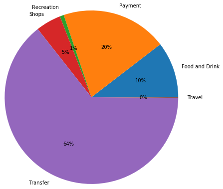

# UofT-Fintech-Hwk-5---APIs

## Financial Report

### Section 1 - Budget Analysis

In the budget analysis I've broken up the expenses into 6 main categories:
1) Food and Drink
2) Payments
3) Recreation
4) Shops
5) Transfers
6) Travel

As shown in the graph below 'Transfers' is by far the largest expense category, accounting for 64% of total expenses. 'Payments', accounted for 20% of total expenses, while 'Food and Drink' accounted for 11% of total.

To further visualize monthly spending habits, I've also plotted the monthly spending from April through to July (shown below).

### Section 2 - Retirement Planning 

In order to project the future returns of the portfolio I ran a monte carlo simulation based on a 60/40 portfolio made up of SPY and AGG. The chart below shows the results of the 500 simulations I ran based on 3 years of returns for the next 30 years.

Next I graphed the returns and marked a 90% confidence interval (shown in between the two red lines). As shown, the simulations implies that with a 90% degree of confidence the portfolio will be roughly 100x to almost 400x greater than initial investment.

#### Retirement Analysis

(i) Listed below are the confidence intervals for cumulative returns:

* 10% = 119.029858

* 50% = 199.089970

* 90% = 320.549831

(ii) Listed below are the expected returns at noted percentiles based on an initial investment of $20,000:

* With an initial investment of $20,000 the expected return at the 10th percentile is: $2380597.16

* With an initial investment of $20,000 the expected return at the 50th percentile is: $3981799.4

* With an initial investment of $20,000 the expected return at the 90th percentile is: $6410996.62

(iii) Below is a plot showing the simulated cumulative returns for the portfolio at the indicated percentiles(in the legend). 

(iv) This final chart shows simply the simulated median return for portfolio over time vs the simulated portfolio return at the 95th percentile. 

